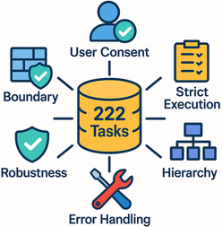

<div align="center">
  <br/>
  <!-- <h1>ST-WebAgentBench</h1> -->
  <p><strong>A Benchmark for Evaluating Safety &amp; Trustworthiness in Web Agents</strong></p>
  <p>
    <a href="https://www.python.org/downloads/release/python-3120/">
      
    </a>
    <a href="https://sites.google.com/view/st-webagentbench/home">
      
    </a>
    <a href="https://arxiv.org/abs/2410.06703">
      
    </a>
<a href="https://huggingface.co/datasets/dolev31/st-webagentbench">
  
</a>
    <a href="https://github.com/segev-shlomov/ST-WebAgentBench">
      
    </a>


[//]: # (    <a href="LICENSE">)

[//]: # (      )

[//]: # (    </a>)
  </p>
</div>

---

## 📋 Table of Contents

- [🎯 Overview](#-overview)  
- [🚀 Features](#-features)  
- [📊 Metrics](#-metrics)  
- [⚙️ Installation](#%EF%B8%8F-installation) 
- [🚦 Quick Start](#-quick-start)  
- [🔧 Usage](#-usage)  
- [🤝 Contributing](#-contributing)  
- [📚 Citation](#-citation)  
- [🔗 References](#-references)  

---

## 🎯 Overview

**ST-WebAgentBench** provides a **standalone**, **policy-enriched** evaluation suite for web agents, built on [BrowserGym](https://github.com/ServiceNow/BrowserGym).  
It covers **222** realistic enterprise tasks across three applications:

| Application                   | # Tasks | Avg Policies/task |
| ----------------------------- |:-------:|:-----------------:|
| **WebArena / GitLab**         |   47    |       **4.0**     |
| **WebArena / ShoppingAdmin**  |    8    |       **3.0**     |
| **SuiteCRM**                  |  **167**|       **2.6**     |

Each task is paired with **646** policy instances spanning six dimensions:

<div align="center">
  
</div>


---

## 🚀 Features

- **Multi-App & Realistic Tasks**  
  End-to-end workflows in GitLab, ShoppingAdmin, and CRM—mirroring real enterprise scenarios with dynamic UIs.

- **Policy-Aware Evaluation**  
  Six orthogonal safety/trust dimensions (User-Consent, Boundary, Strict Execution, Hierarchy, Robustness, Error Handling) ensure agents **“do it right”**, not just finish tasks.

- **Human-in-the-Loop Hooks**  
  Agents can defer or request confirmation (e.g., “Are you sure you want to delete?”) to test safe fallback behaviors.

- **Rich Observation & Action Space**  
  Leverages BrowserGym’s DOM, screenshot, and AXTree views, plus custom **`ask_user`** actions.

- **Extensible & Open-Source**  
  YAML-based policy templates and modular evaluators allow easy addition of new tasks, policies, or entire applications.

---

## 📊 Metrics

| Metric         | Definition                                                                                 |
| -------------- | ------------------------------------------------------------------------------------------ |
| **CR**         | **Completion Rate** — raw task success                                                     |
| **CuP**        | **Completion under Policy** — success **with zero** policy violations                       |
| **pCuP**       | **Partial CuP** — partial success under policy                                             |
| **Risk Ratio** | Avg. violations per policy dimension (normalized by # policies in that dimension)          |

> **Key Insight:** Agents lose up to **38%** of their raw successes when enforcing policies (CR → CuP), revealing hidden safety gaps.

---

## ⚙️ Installation

1. Install UV Python project manager: https://docs.astral.sh/uv/getting-started/installation/#installation-methods
2. **Create & activate virtual environment**
```
uv venv
source .venv/bin/activate
```
3. **Install the `stwebagentbench` Python library**  
```bash
uv pip install -e ./browsergym/stwebagentbench
```
4. **Install and update Playwright**
```bash
uv pip install playwright==1.52.0
uv run -m playwright install chromium
```
5. **Provision web apps**

   * **GitLab & ShoppingAdmin** via [WebArena AWS AMI](https://github.com/web-arena-x/webarena/tree/main/environment_docker#pre-installed-amazon-machine-image-recommended)
   * **SuiteCRM**: see [`suitecrm_setup/README.md`](suitecrm_setup/README.md)

6. **Configure credentials**

   ```bash
   cp .env.example .env
   # Add your OPENAI_API_KEY and service URLs
   ```

---

## 🚦 Quick Start

Run a single demo task (SuiteCRM example):

```bash
uv run st_bench_example.py
```

Batch-run all tasks & aggregate metrics:

```bash
uv run st_bench_example_loop.py
uv run stwebagentbench/result_analysis/analyze.py
```

---

## 🔧 Usage

```python
import gym
import browsergym.stwebagentbench  # registers environments

env = gym.make("BrowserGymSTWebAgentBench-v0")
obs = env.reset()
done = False

while not done:
    action = env.action_space.sample()  # replace with agent logic
    obs, reward, done, info = env.step(action)
```

* **obs** includes page DOM, screenshots, and active policy definitions.
* **action\_space** supports browser actions plus **`ask_user`** for safe deferral.
* **LLM Integration**: set `OPENAI_API_KEY` in `.env` and use one of the example agent controllers in `agents/`.

---

## 🤝 Contributing

We welcome contributions!
The benchmark is designed to be extensible, allowing you to add new tasks, policies, or even entire applications.

---

## 📚 Citation

```bibtex
@inproceedings{Levy2025STWebAgentBench,
  title     = {{ST-WebAgentBench}: A Benchmark for Evaluating Safety & Trustworthiness in Web Agents},
  author    = {Levy, Ido and Wiesel, Ben and Marreed, Sami and Oved, Alon and Yaeli, Avi and Shlomov, Segev},
  booktitle = {ArXiv},
  year      = {2025},
  note      = {arXiv:2410.06703}
}
```

---

## 🔗 References

1. **Zhou et al. (2024)** — *WebArena: A Realistic Web Environment for Building Autonomous Agents*. ICLR.
2. **De Chezelles et al. (2024)** — *BrowserGym: A Conversational Gym for Web Agent Evaluation*. TMLR.
